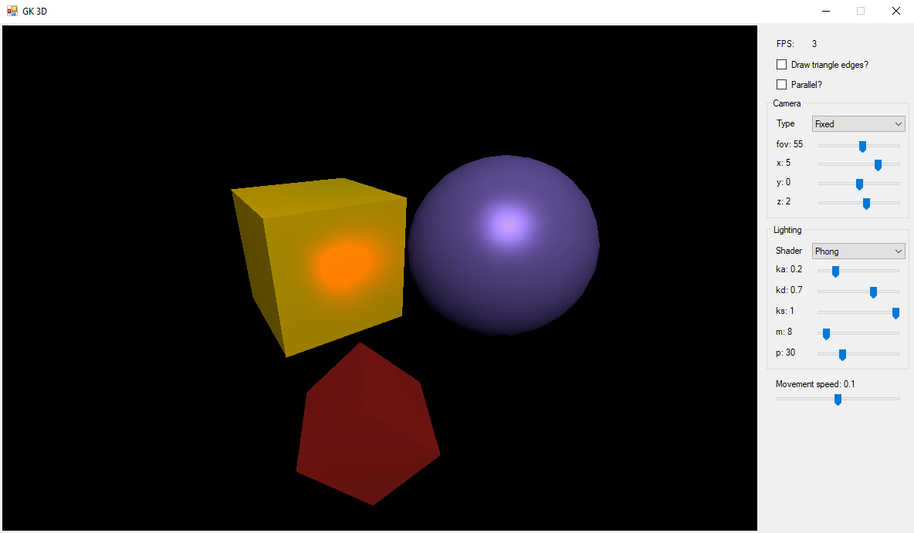

# 3D application prepared for computer graphics course

The application implements 3D lighting without using any third-party packages.
It displays a moving cube with a forward-facing spotlight illuminating a cube and a sphere in front of it. There's also a still light source above the whole scene illuminating all the objects.

The app implements 3 different camera types:
* fixed (in front of all the objects)
* following moving (fixed behind the moving cube)
* following fixed (fixed in front of all the objects, but rotating to track the moving cube)

The app also includes three shading types:
* Phong (precisely calculating the light in every pixel shown on the screen)
* Gouraud (precisely calculating the light in vertices of the triangles and interpolating the remaining values)
* constant (precisely calculating only a single value for each triangle)

Extra info:
* parameters of the light might be altered
* there is a parallel computing mode
* the field of view and the position of the camera might both be altered
* it is possible to alter the movement speed of the moving cube

